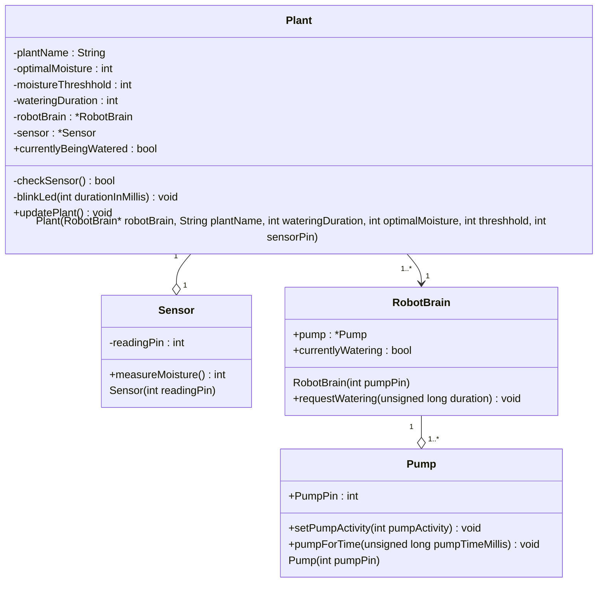

# PWTech
Plant Watering Tech - [Website](https://hpyGithub.github.io)

### Moisture Measurements
| Zustand | Messwert | 
| --- | --- |
| trocken | 485 |
| nass | 204 |
| trocken | 465 |
| trocken | 440 |
| nass (direkt beim Gießen) | 205 |
| nass | 220 |
| übergossen | 191 |

***
### class diagram of the code base

*(last updated: 03.02)*

