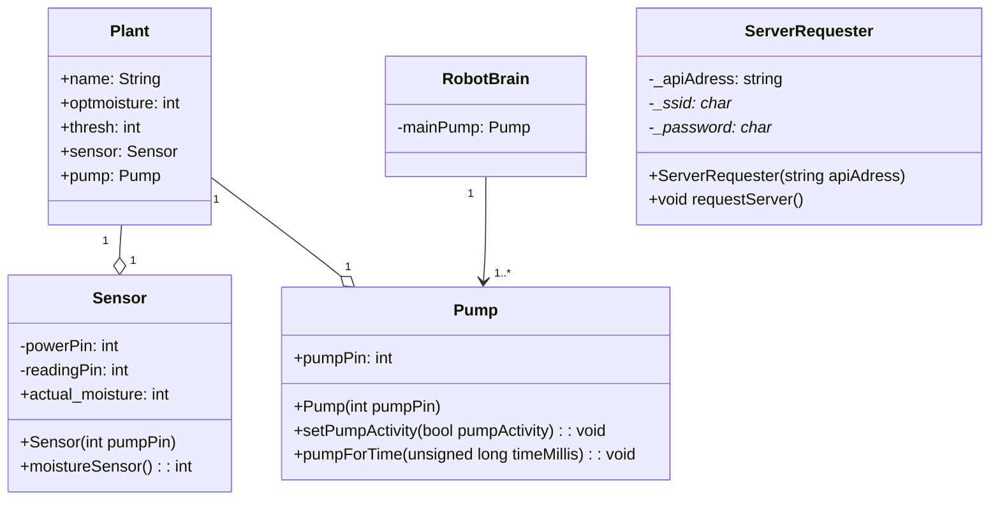

# PWTech
Plant Watering Tech - [Website](hpyGithub.github.io)

### Roadmap
| file/component name | file type |
|------|-----------|
| Pumping Unit | Header |
| Sensor Unit | Header |
| Plant Header | Header |
| Robot Brain | Arduino-Datei |
| Main Server | Header |

***
### class diagram of the code base

*(last updated: 23.01)*

